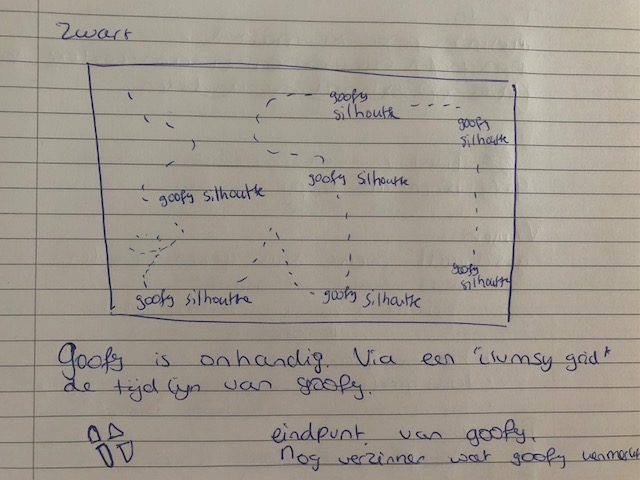
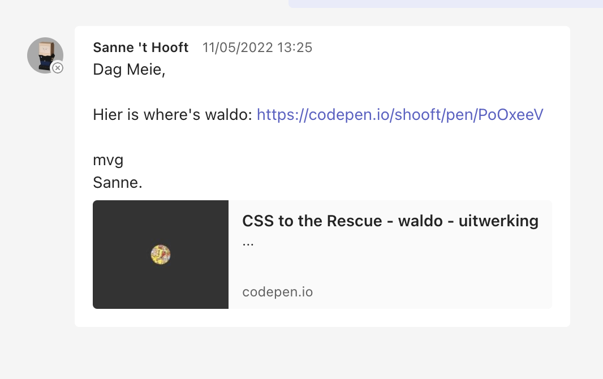
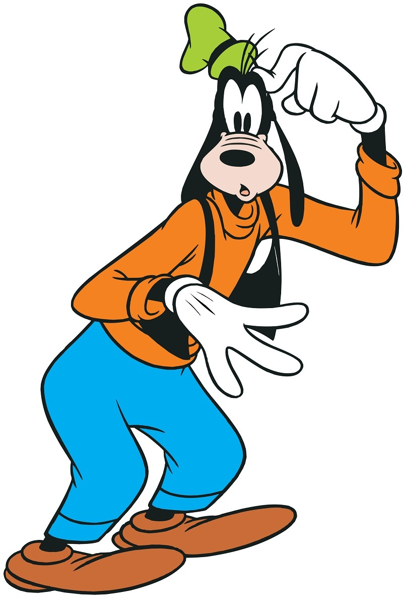
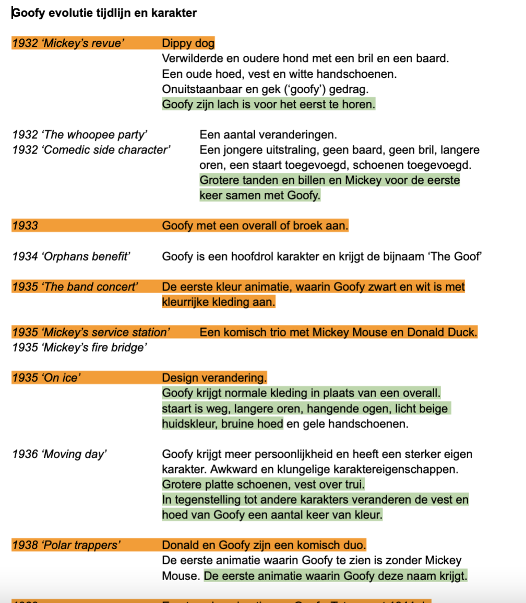
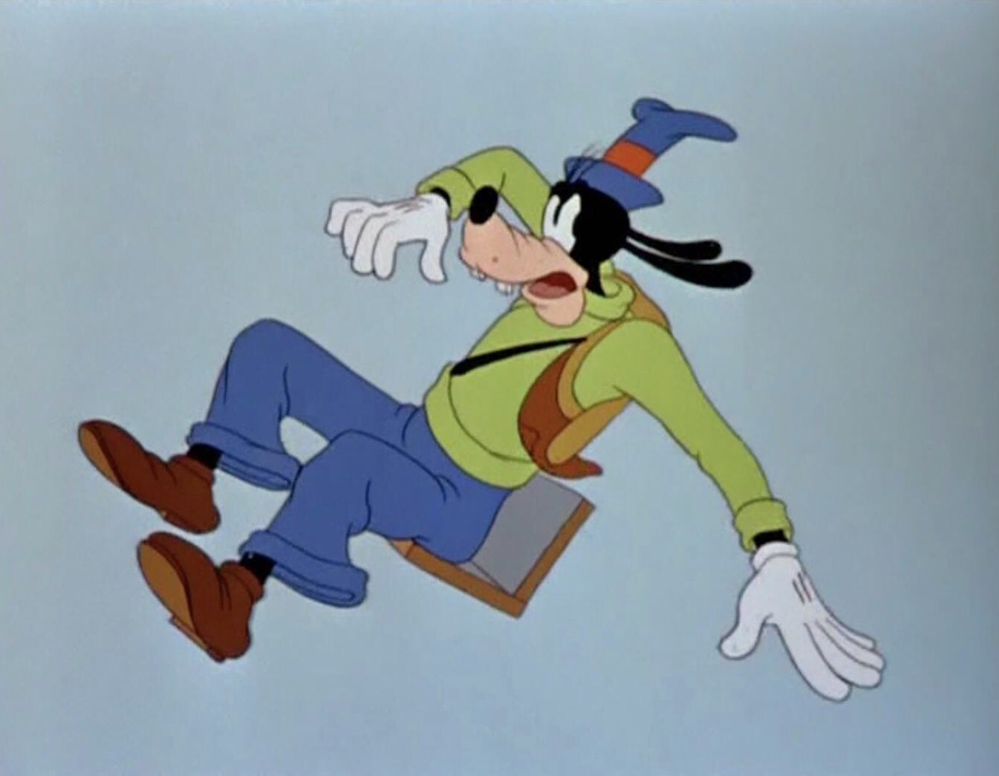
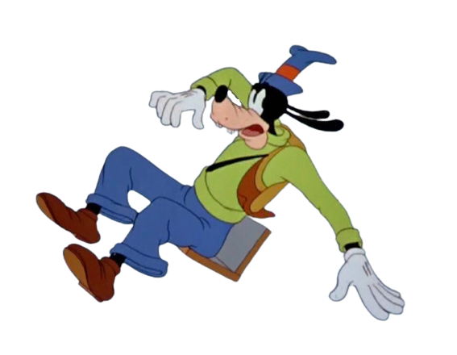
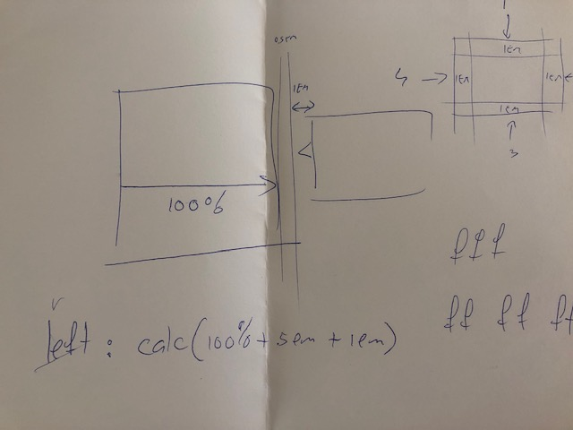
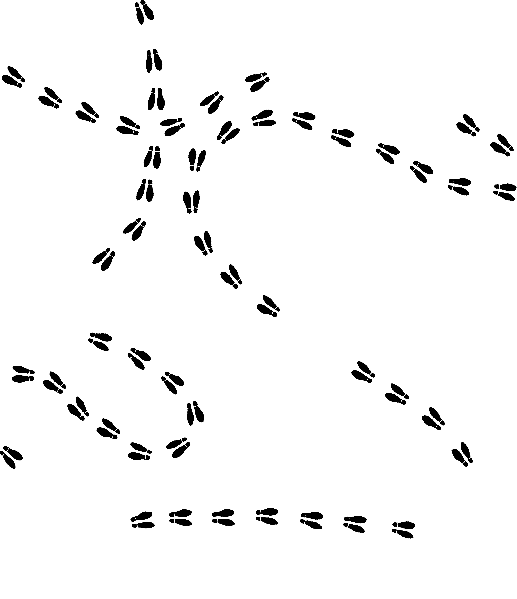
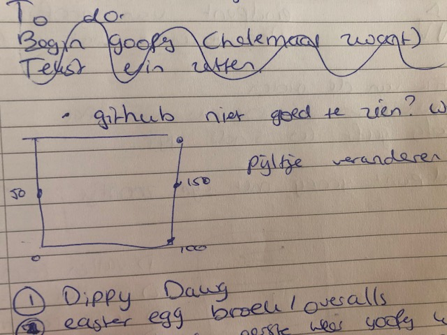
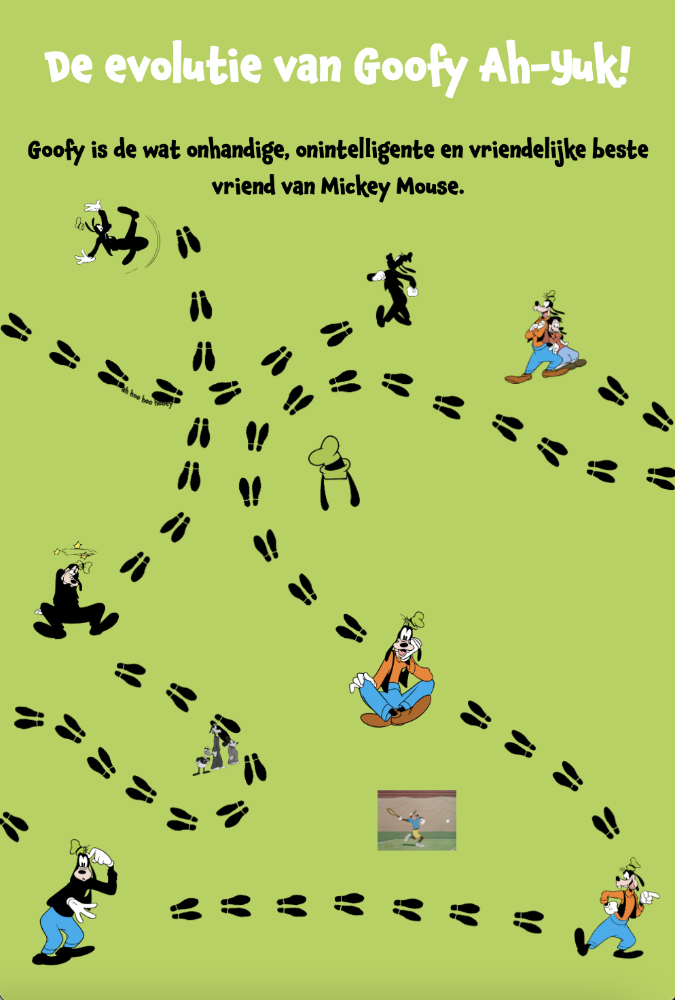

# basiswebsite-timeline
Een website van Goofy als klassiek karakter.  
 
Ik heb een website van het Disney karakter Goofy gemaakt. Het was belangrijk dat het design het karakter weerspiegelt. 

## Jij

### Ontwerper:
Meie van Wonderen 

#### Je startniveau:
Mijn startniveau is: De eerste keer wintersport, groen. 

# Je plan
Concept:
Mijn concept laat mensen kennismaken met het karakter Goofy. Goofy begon als een klein karakter in de Mickey Mouse animatie shorts. Tegenwoordig is het karakter welbekend en is Goofy de beste vriend van Mickey Mouse en Donald Duck. Net zoals de onhandige Goofy is het design van mijn website ook onhandig. Door een pad dat over het gehele scherm gaat volgt de gebruiker Goofy. Onderweg leert de gebruiker Goofy steeds beter kennen.   

Interactie/bediening:
Op het voetpad zijn clickbare Goofy's. Als de gebruiker over de Goofy hovert komt er een quote te zien van Goofy. Als de gebruiker op de Goofy clickt is er een andere Goofy te zien van een bepaald jaartal. Door de jaren heen is Goofy verandert. Aan het begin van het pad zie je dan ook alleen het silhoutte van Goofy en langszaam ziet de gebruiker alle 'Goofy' onderdelen die het karakter Goofy een Goofy maken.  

Er zijn ook easter eggs door het pad heen. Hoewel ze duidelijk zichbbaar zijn dienen de easter eggs vooral als kleine weetjes over Goofy. 

Progressive disclosure:
Op het scherm zijn verschillende Goofy's te zien. Als je met de muis over de Goofy beweegt, dan ziet de gebruiker een tekstwolkje. Ook ziet de gebruiker een gekleurde achtergrond, dat de gebruiker duidelijk wil maken dat Goofy een klikbaar onderdeel is van de website. Als de gebruiker op de Goofy klinkt verandert de Goofy aan de hand van een animatie in een ander plaatje met een ander tekstwolkje. 

Details:
Door op elke Goofy te klikken is er een schaduw te zien. Hierdoor is het duidelijk dat elke Goofy klikbaar is. Bij elke klik verschijnt het spreekwolkje alleen als de gebruiker over de Goofy beweegt met de muis. Elke Goofy heeft een andere overgangsanimatie die bij het plaatje past.  

  ### De eerste versie/schets:
  

  ### Je ambitie: 
  De eerste ervaring die ik met CSS en HTML heb gehad is bij het vorige vak van deze minor. Ik wil het beter begrijpen en langere code kunnen schrijven. 
  - Ik wil een code kunnen schrijven en begrijpen. 
  - Ik wil het concept dat in mijn hoofd zit kunnen realiseren met coderen. 
  - Ik heb geen ervaring met JavaScript. Ik vind het een uitdaging om iets hierin te doen. 

## Voortgang/Feedback 1
Mijn eerste concept was wat ingewikkelder met programmeren. Ik wist nog niet hoe ik de 'Where is Waldo code' van meneer 't Hooft kon toepassen in mijn website. Daarom heb ik nagedacht over een nieuw design gemaakt van 5 lagen met Goofy. Mijn bevindingen + wijzigingen (minimaal 5)

  ### Bevinding 1:
  
  
  Ik heb een concept gemaakt waarin ik de code van meneer 't Hooft wil toepassen. Ik denk alleen dat deze code te moeilijk is voor mij. 
  
   
  

  #### oplossing:
  Ik heb het niet kunenn oplossen. Ik heb de code van meneer 't Hooft niet toegepast in mijn code. Ik heb toen wel dit proberen op te lossen door een nieuw concept te verzinenn met 5 gekleurden lagen die Goofy waren. Dit kwam toen wel met nieuwe bevindingen.

  ### Bevinding 2:
  De 5 lagen van Goofy waren niet onderscheidend genoeg. 
  
  ### oplossing:
  Ik heb dit opgelost door een kleurenpalette te maken. Deze kleuren haalden ik uit de kleuren van Goofy. De groene kleur is van de hoed, de beige kleur is de huidskleur, de blauwe kleur is van de broek etc. 
  
  Colour pallette Goofy 
  - Oranje #F58221
  - Blauw #00AEEF
  - Zwart #000000
  - Wit #FFFFFF
  - Beige #F3D9CE 
  - Groen #A6CE39 
    
    

  ### Bevinding 3:
  Ik heb een ander concept bedacht, maar meneer 't Hooft geeft aan dat dit concept niet sterk genoeg is voor Goofy. 'Waarom is dit Goofy?'(tekst en afbeeding(en)).

  #### oplossing:
  Ik heb het opgelost doordat ik helemaal opnieuw ben begonnen en ben gaan kijken wat een makkelijker idee is voor mij. Het eerste idee van 'Where is Waldo' was een sterk concept. Ik heb dit concept toen makkelijker gemaakt door te kiezen voor een pad dat je kan volgen en tegelijkertijd op een Goofy manier moet volgen. De Goofy manier was een wat onhandig pad dat door elkaar loopt over het volledige scherm. 
  
   
   
   
   ### Bevinding 4:
   Ik weet zelf niet per se wat unieke eigenschappen zijn van Goofy. 
   
   #### oplossing:
   Ik heb veel onderzoek gedaan naar het personage Goofy. Hiervoor heb ik verschillende filmpjes gekeken en verschillende websites gezien die het over Goofy hebben. Ik heb zelf een bestandje gemaakt met informatie die ik interessant vond om op de website te kunnen gebruiken. 
  
   
   
   
   ### Bevinding 5: 
   In illustrator kan de achtergrond van de afbeelding weg worden gehaald. 
   
   #### oplossing:
   Ik heb op mijn eigen studie niet heel veel gewerkt met Illustrator. Ik had begrepen dat content via Illustrator in de website geplakt konden worden. Daarom heb ik uitleg bekeken hoe je de achtergrond van een plaatje verwijderd, om zo zelf content toe te voegen aan de website.  
  
   
   

## Voortgang/Feedback 2
Het nieuwe concept is uitgewerkt in css en html. Door foto's eerst vanuit Illustrator te bewerken en afbeeldingen daarna in de images mak te verplaatsen kan ik content aan mijn website toevoegen. 

  
  ### Bevinding 1:
  De tekst in het spreekwolkjes heeft geen grid en het spreekwolkje staat te dichtbij op een Goofy.  

  #### oplossing:
  Door een grid (display) toe te voegen in het spreekwolkje en het in het midden (center) te plaatsen met een rand (padding) die even groot is, staat de tekst netjes in het spreekwolkje. Het is opgelost door de afbeelding en de spreekwolk samen in een button te zetten. Deze button is 'een doosje' waar de spreekwolk en afbeelding in staan. Door een calculatie te maken van de hoeveelheid afstand staat het spreekwolkje nu van de afbeelding af. 
  
  

  ### Bevinding 2:
  Ik kan niks vinden. Alle code die ik had gemaakt staat door elkaar en niet op de goede volgorde. 

  #### oplossing:
  In de powerpoint stond welke volgorde je moet aanhouden. Door meer witruimtes tussen de regels toe te passen en comments aan te geven /**/ krijg ik veel beter overzicht in mijn codes. Ook heeft de functie 'Beautify' heel erg geholpen om mijn code netjes te houden. 

  ### Bevinding 3:
  Het pad van de voetstappen moet verbonden zijn en om elke voetstap individueel op de website te zetten gaat heel veel tijd kosten. 
  
  #### oplossing:
  Met de feedback van meneer 't Hooft is het mogelijk om de voetstappen in Adobe Illustrator als achtergrond te gebruiken. In adobe heb ik de voetstappen in een bepaalde richting laten lopen. 

   
   
   
   ### Bevinding 4:
  Ik wil dat de afbeelding clickbaar is. 

  #### oplossing:
  Door van de afbeelding een button te maken de afbeelding clickbaar. Dit doe je door een code te schrijven in CSS en HTMl. In de html krijgt de afbeelding in de main een id, zodat elke button een ander plaatje aanklikt. In deze button komt het plaatje te staan, zodat de afbeelding een button is geworden. In de CSS krijgt elke button een eigen grootte (width), hoogte (top) en breedte (left). 
  
  
   ### Bevinding 5:
   Ik wil animaties toevoegen in de overgang, maar ik weet niet hoe ik dit moet toepassen. 

  #### oplossing:
  Door onderzoek te doen naar al bestaande CSS animaties kan ik deze animaties als bron overnemen. Hoewel ik zelf niet op het level van coderen zit dat ik de animaties weldegelijk zelf kan verzinnen, kan ik op deze manier toch animaties toevoegen aan mijn website. In de bronnenlijst is te zien dat ik heel vaak de website Animista heb gebruikt. 

## Voortgang/Feedback 3
  
  ### Bevinding 1:
  De plaatjes van Goofy werden niet groter en kleiner aan de hand van de grootte van de website. 
  
  #### oplossing:
  Dit is opgelost door in de code de em waarden te veranderen naar vw. Dit staat nu met de widt mee van het scherm. Hierdoor blijven de Goofy plaatjes niet staan en zullen ze meeschalen met het scherm. 

  ### Bevinding 2:
  Het spreekwolkje moest niet alleen alleen de rechterkant staan, maar ook aan de linkerkant. 

  #### oplossing:
  Door het spreekwolkje op te splitsen in twee verschillende waarden kan ik elk spreekwolkje apart van elkaar veranderen. Het driehoekje moet zich omdraaien en aan de andere kant van het spreekwolkje komen te staan. 
  
  

  ### Bevinding 3:
  Het plaatje veranderen in een ander plaatje met een andere tekstwolk. 
  
   #### oplossing:
  Dit heb ik samen met Milan gedaan. Hij heeft me geholpen met een code in JavaScript te schrijven. Hij heeft een basiscode geschreven die ik op elke andere Goofy kan aanpassen en die ik heb leren begrijpen, zodat ik dit allemaal zelf kan aanpassen. 
  
  
  ### Bevinding 4:
  Onder het scherm was een groenvlak over dat niet weg ging. 
  
   #### oplossing:
  Door de afmetingen te bekijken van de voetstappen en daar een kruisrekensom van te maken was de uitkomst de oplossing voor mijn code. De hoogte van mijn main was nu aangepast, zodat de hoogte gelijk liep met de hoogte van mijn voetstappen. 
  
  
   ### Bevinding 5:
   Het spreekwolkje is niet groot genoeg voor de hele tekst. 
  
   #### oplossing:
  Door een min-heigt toe te voegen kan ik de spreekwolkjes aanpassen, zodat elke tekst past. 

## Reflectie
Mijn eindresultaat & persoonlijke ontwikkeling

  ### Je uitkomst - karakteristiek screenshot(s):
  

  ### Dit ging goed/Heb ik geleerd: 
  Ik heb geleerd dat een schone code heel fijn is om mee te werken. Niet alleen is gemakkelijk om mee te werken, maar het is ook overzichtelijk voor anderen. Hierdoor konden anderen mij ook beter helpen. Daarnaast heb ik veel meer kennis opgedaan van CSS, JavaScript en HTML. Alle 3 de programma's kende ik niet goed en van alle 3 de programma's heb ik heel veel nieuwe dingen geleerd. 

  ### Dit was lastig/Is niet gelukt:
  Soms is het me niet gelukt om helemaal zelf aan de slag te kunnen gaan met de code. Als ik soms vast liep had ik niet genoeg kennis om te kunnen achterhalen wat ik dan precies niet goed had gedaan. Door middel van heel veel hulp van meneer 't Hooft en andere klasgenootjes heb ik uiteindelijk toch een eindresultaat kunnen inleveren, dat ik van te voren niet had verwacht.  

## Bronnenlijst
Goofy heeft bekende uitspraken, die Goofy Goofy maken: 
- https://disney-magical-world.fandom.com/wiki/Goofy:_Quotes_and_Scripts

De bronnen voor html, css en javascript: 
- https://css-tricks.com/snippets/css/a-guide-to-flexbox/ 
https://www.markdownguide.org/cheat-sheet/ 
- https://www.w3schools.com/cssref/sel_hover.asp 
- https://css-tricks.com/the-shapes-of-css/ 
- https://animista.net/play/basic/flip/flip-vertical-left 
- https://animista.net/play/basic/rotate/rotate-right 
- https://animista.net/play/attention/jello 
- https://animista.net/play/attention/wobble
- https://animista.net/play/attention/bounce/bounce-top 
- https://animista.net/play/attention/blink/blink-2 
- https://animista.net/play/entrances/rotate-in/rotate-in-left

Bronnen voor Goofy 
- https://www.youtube.com/watch?v=VuH3Rp-Mnwg 
- https://disney.fandom.com/wiki/Goofy_Through_the_Years 
